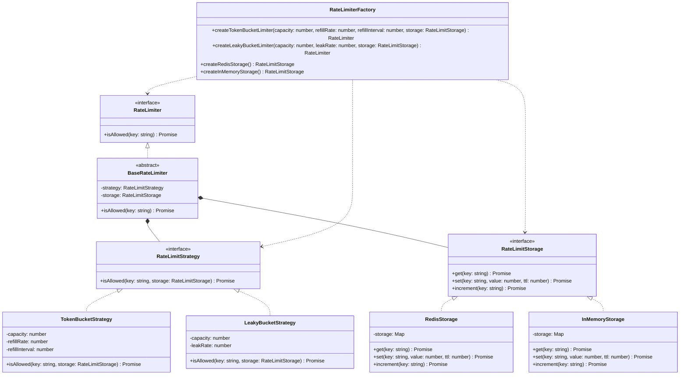

一、实现一个灵活可扩展的API请求限流器 [RateLimiter]，要求如下：
  - 支持对不同请求对象进行限流控制，可以是全局限流（所有用户共享限额）或针对特定对象（例如，根据用户ID进行限流）
  - 至少实现两种常见的限流策略（如漏桶算法、令牌桶算法），并且能够方便地扩展更多限流策略
  - 默认使用Redis作为限流数据的存储系统，同时支持轻松切换或扩展为其他存储系统（如数据库、内存等）
  - 提供详细的使用文档和类库的结构设计图，帮助开发者快速理解和上手使用;

**A:**
结构设计图如下：




这个请求限流器涉及的设计模式包括：
1. **策略模式（Strategy Pattern）**：通过策略接口和不同策略类实现限流算法的灵活选择。
2. **工厂方法模式（Factory Method Pattern）**：通过工厂类创建不同类型的限流器和存储。
3. **抽象工厂模式（Abstract Factory Pattern）**：工厂类提供方法来创建相关的限流器和存储对象。
4. **模板方法模式（Template Method Pattern）**：在 `BaseRateLimiter` 中定义了限流逻辑的骨架，具体策略类提供实现。
5. **适配器模式（Adapter Pattern）**：`RedisStorage` 和 `InMemoryStorage` 适配了 `RateLimitStorage` 接口。
6. **组合模式（Composite Pattern）**：`BaseRateLimiter` 和 `RateLimitStrategy` 类通过组合的方式实现灵活的限流策略切换。

快速使用方法如下：

```java

    // 创建一个使用令牌桶算法的全局限流器，使用Redis存储
    RateLimiter globalLimiter = RateLimiterFactory.createTokenBucketLimiter(
            100, // 容量
            10, // 每秒填充速率
            1000, // 填充间隔（毫秒）
            RateLimiterFactory.createRedisStorage("localhost", 6379)
    );

    // 创建一个使用漏桶算法的用户级限流器，使用内存存储
    RateLimiter userLimiter = RateLimiterFactory.createLeakyBucketLimiter(
            5, // 容量
            1, // 每秒漏水速率
            RateLimiterFactory.createInMemoryStorage()
    );

    // 模拟请求
    for (int i = 0; i < 10; i++) {
        boolean globalAllowed = globalLimiter.isAllowed("global");
        boolean userAllowed = userLimiter.isAllowed("user123");

        System.out.println("请求 " + (i + 1) + ":");
        System.out.println("  全局限流: " + (globalAllowed ? "允许" : "拒绝"));
        System.out.println("  用户限流: " + (userAllowed ? "允许" : "拒绝"));

        Thread.sleep(200); // 每次请求间隔200毫秒
    }


```


------


二、通过数据库的慢日志，我们发现了一个慢请求[执行时间 > 1s]，原始SQL和Explain分析结果如下

```
SELECT 
    filed_a
FROM table_l 
JOIN table_d on table_l.id = table_d.id
WHERE
    table_l.date_end >= DATE('2019-07-01')
    AND table_l.date_end < (DATE('2019-07-01') + INTERVAL 1 month)
    AND table_l.date_end >= table_l.date_start
    AND table_l.flag = 1
    AND table_l.type = "S"
    AND table_d.id_m = 1234
```

| id   | select_type | table   | partitions | type   | possible_keys                             | key            | key_len | ref        | rows  | filtered | Extra                    |
| ---- | ----------- | ------- | ---------- | ------ | ----------------------------------------- | -------------- | ------- | ---------- | ----- | -------- | ------------------------ |
| 1    | SIMPLE      | table_l |            | range  | PRIMARY,flag,date_end,type,flag_type_date | flag_type_date | 40      |            | 61708 | 33.33    | Using where; Using index |
| 1    | SIMPLE      | table_d |            | eq_ref | PRIMARY,id_m                              | PRIMARY        | 4       | table_l.id | 1     | 5.00     | Using where              |

- table_l是主表、table_d是副表，总数据量接近1KW

- 其中 flag_type_date 为组合索引  KEY flag_type_date (flag,type,date_end,date_start)

- DATE('2019-07-01')、flag = 1、'S'、1234 这几个参数值都会根据场景而不同

- 请根据上述信息，给出可能的优化办法并说明原因 

  

**A:**

根据提供的 `EXPLAIN` 执行计划信息，进一步分析当前查询的执行情况。

##### 1. **`table_l` 的查询执行计划**

- **type**: `range`
   说明 MySQL 使用了范围扫描（range scan）来检索 `table_l` 表的数据。这意味着 MySQL 将在符合条件的索引范围内扫描数据，并且索引 `flag_type_date` 被使用。
- **key**: `flag_type_date`
   这是一个组合索引，包括 `flag`、`type`、`date_end`、`date_start` 等列。该索引在执行过程中被成功使用，表明它对查询中的 `WHERE` 条件有效。
- **Extra**: `Using where; Using index`
   这表示 MySQL 使用了索引，但仍然需要对扫描的结果进行额外的过滤操作。虽然使用了索引来减少扫描的行数，但过滤条件可能导致一些额外的计算。

###### 改进建议：

1. **索引优化**：
   - 尽管 `flag_type_date` 索引被使用，但 `date_end >= DATE('2019-07-01')` 和 `date_end < (DATE('2019-07-01') + INTERVAL 1 month)` 是范围条件，而索引中 `date_start` 排在 `date_end` 后面，这可能影响到索引的有效性。因此，考虑调整索引顺序，将 `date_end` 排在前面，形成如 `(date_end, flag, type, date_start)` 的索引。
   - 如果查询中经常使用 `date_end` 作为过滤条件，确保 `date_end` 是索引的第一列，以使范围查询能够高效执行。
2. **避免多次计算的日期函数**：
   - SQL 中使用了 `DATE('2019-07-01')` 和 `DATE('2019-07-01') + INTERVAL 1 month`，这两个计算可能会使 MySQL 无法利用索引。为了避免这种情况，可以考虑将日期计算移到查询外部，即在应用程序中计算这些日期，并作为常量传递给查询。
3. **确认 `table_l` 的数据分布**：
   - 由于 MySQL 使用了范围扫描，考虑检查 `table_l` 的 `date_end` 列的分布情况。如果大多数行的 `date_end` 值都集中在某个范围内，可以通过分区表来优化查询性能，特别是在日期范围查询时。

##### 2. **`table_d` 的查询执行计划**

- **type**: `eq_ref`
   说明 MySQL 在 `table_d` 上使用了最优的连接方式 `eq_ref`，这表示每一行 `table_l` 表中的数据都会在 `table_d` 表中找到唯一匹配的行。这里 `id_m` 列是通过 `PRIMARY` 索引查找的，表明这列数据是非常高效的。
- **key**: `PRIMARY`
   MySQL 使用了 `PRIMARY` 索引来匹配 `table_d.id_m = 1234`，这意味着 `id_m` 是索引的一部分且具有唯一性，查询非常高效。

###### 改进建议：

- **`table_d` 的优化不需要修改**：从执行计划来看，`table_d` 的查询已经非常高效，因为使用了 `eq_ref` 类型的连接，并且 `id_m` 已经索引。因此，在 `table_d` 上不需要进一步优化。

##### 3. **改进其他方面的考虑**

- **避免 `WHERE` 子句中的冗余条件**：查询中的条件 `table_l.date_end >= table_l.date_start` 会增加额外的筛选步骤，特别是当 `date_start` 列没有合适的索引时，可能导致性能下降。如果 `date_start` 在查询中经常被使用，可以考虑对该列建立索引。
- **查询的字段优化**：
  - 目前查询中只选择了 `filed_a` 字段，这意味着查询返回的数据量已经相对较小。确保在实际使用中，查询只返回需要的字段，避免使用 `SELECT *`。

##### 4. **总结优化建议**

1. **调整索引顺序**：
   - 重新设计 `table_l` 的索引，使其更加匹配查询的过滤条件。尤其是考虑将 `date_end` 列排在索引的前面，以优化范围扫描。
2. **移除查询中的动态日期计算**：
   - 将 `DATE('2019-07-01')` 和 `DATE('2019-07-01') + INTERVAL 1 month` 等计算移至外部，减少查询中的计算量，确保 MySQL 可以更好地利用索引。
3. **为 `table_l` 的 `date_start` 列创建索引**：
   - 如果 `date_start` 列在查询中经常被使用，考虑为该列创建索引，以减少 `WHERE` 子句中额外的过滤操作。
4. **分区表**（如果数据量很大）：
   - 如果 `table_l` 表的数据量非常大，且查询通常基于时间范围（如 `date_end`），可以考虑将 `table_l` 表按时间进行分区，尤其是按月或按年分区，以减少查询时的扫描范围。
5. **验证执行计划**：
   - 对优化后的 SQL 执行计划进行验证，确认优化是否有效，使用 `EXPLAIN` 查看新的查询执行计划是否更为高效。

------

三、请描述一段在工作中给你留下深刻印象的工程实现或项目开发经历，包括以下方面：
  - 简要介绍项目的背景、目标及其对公司或业务的重要性;
  - 项目团队的组成以及你在项目中扮演的角色;
  - 在项目过程中，你遇到的一个关键技术挑战是什么？请具体描述这个问题的复杂性或难点;
  - 通过图文并茂的方式，详细描述你是如何分析并解决这一技术难题的;


代表性的一个技术挑战是他在**阿里云分布式数据库**项目中解决的**数据一致性与同步问题**。以下是如何描述这个项目，并具体分析技术挑战及解决方案。

##### 项目背景与目标

**阿里云分布式数据库项目**旨在提升阿里云的数据库平台的可用性、扩展性和性能。随着阿里云平台的扩展，数据库服务需要处理更大规模的用户数据和高并发请求，因此要求平台具备高可靠性和高吞吐量。

- **目标**：
  - 重构分布式数据库管控平台，提高平台稳定性、可扩展性。
  - 增强监控和报警系统，确保及时响应系统问题。
  - 设计和开发基于分布式数据库的CDC（Change Data Capture）生态，实现数据同步，保证数据的一致性和完整性。
- **重要性**：
  - 该项目对于阿里云来说至关重要，因为它直接关系到云数据库的稳定性和数据一致性，影响到阿里云服务的质量和客户体验。
  - 高可用的分布式数据库对于支持大规模、实时的数据同步至关重要，特别是在云计算环境中，能够保持跨地域、跨系统的数据一致性和事务保障。

##### 项目团队组成与角色

- 项目团队组成

  该项目的团队由数据库工程师，数据库运维工程师，前端工程师，QA工程师组成。团队成员分工明确，负责平台重构、数据库优化、系统监控和数据同步等各个模块。

- 角色

   在该项目中担任技术专家和核心开发角色，负责**分布式数据库管控平台的重构**，包括**监控体系搭建**和**CDC开发**。

   主导了分布式数据库一体化售卖体系的设计与开发，并且优化了基于分布式数据库的逻辑binlog和CDC生态系统，解决了多个分布式数据库节点的数据同步和一致性问题。

##### 关键技术挑战

**关键技术挑战**：如何在分布式数据库环境中实现**数据的一致性和事务保障**，并且确保跨多个数据库实例的数据同步具有高可用性和低延迟。

- 在分布式数据库中，数据一致性问题变得尤为复杂。尤其是当数据分散在不同节点或数据库实例中时，如何保证数据同步的顺序和事务的原子性是一个巨大的挑战。
- 由于数据可能存在延迟、丢失或者乱序，如何设计一个高效且可靠的数据同步机制，确保各个数据库实例的数据一致性、事务的一致性是技术难点。
- 另一个挑战是**CDC（Change Data Capture）**的实现，即如何在不影响生产系统性能的情况下，实时捕获并同步不同数据源的变更。

##### 解决方案

1. **构建逻辑binlog**：
   - 通过基于分布式数据库的逻辑binlog，确保了跨多个数据库节点的数据一致性。逻辑binlog能够记录数据库变更的详细信息（如增、删、改操作），并且支持顺序和事务一致性的保证。
   - **设计方案**：他利用分布式事务协调算法来确保不同数据库实例的变更操作具有全局一致性。
2. **CDC（Change Data Capture）生态的构建**：
   - 基于逻辑binlog，设计了一个CDC生态系统，将数据从分布式数据库同步到其他系统（例如AP型数据库、Kafka消息队列、大数据平台MaxCompute等）。
   - 方案设计
     - 使用**Kafka**作为数据同步的中间层，确保数据在不同系统间的流转无损失，并且可以保证高吞吐量和低延迟。
     - 为了保证数据的顺序性和一致性，他设计了自定义的分布式事务日志系统，通过**事务ID和时间戳**对数据变更进行排序，确保最终一致性。
3. **高可用设计与容错处理**：
   - 针对系统的高可用性，设计了容错机制，如**数据副本**和**自动恢复机制**，确保在节点故障时，数据能够无缝恢复，并且同步任务能够自动恢复，最小化系统停机时间。
   - 在数据同步过程中，他还引入了数据校验机制，通过比对源数据和目标数据，确保在多节点环境中，数据的一致性没有被破坏。

